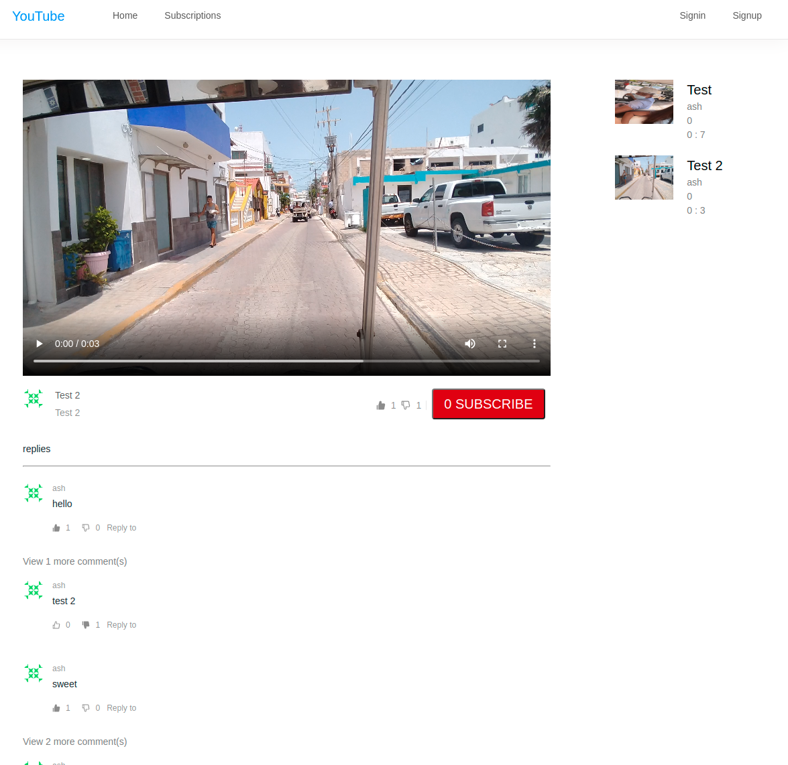

# Youtube Clone

## Deployed Link: https://youtube-clone-ab.herokuapp.com/

## Technology Used:

- React
- Node js
- Mongoose
- MongoDB
- Express
- Multer
- Fluent-ffmpeg
- Redux
- React-dropzone

## Installation:

- Fork/Clone or Download Zip
- Create dev.js file inside config folder and add MongoDB URI
- Run npm install in root and client directories
- Run npm run dev in root directory to start application

## User Stories

- As a user I would like to be able to watch videos
- As a user I would like to be able to like or dislike videos
- As a user I would like to be able to subscribe to content creators
- As a user I would like to be able to upload content

## Bugs

- Can upload on localhost server but recieve status 503 when uploading on deployed server.
